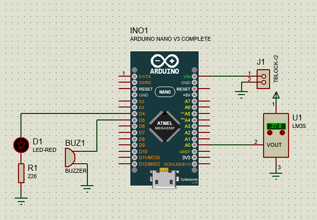
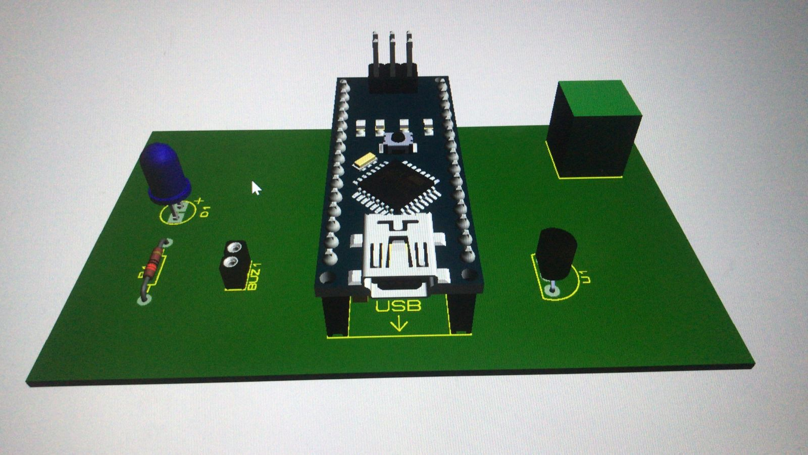
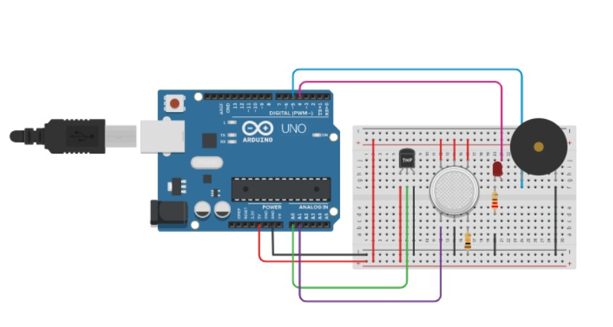

# DesafioProteus-Locobots

<h2>O que é o Projeto</h2> 

Desenvolvido por Gessica e Graziele, o projeto é um <b>alarme de incêndios</b> controlado por arduino.

<h4>Componentes utilizados:</h4> 
<ul>
 <li>LM35 - sensor de temperatura analógica, mede temperaturas na faixa de 0-100 graus com uma precisão de 0,5 e com tensão de saída linear de 10mV/graus. Para cada 10mV de tensão na saída, representa 1ºC.</li>
 <li>Buzzer - emissão de som</li>
 <li>LED-RED - apresenta tensão de 2.8V e corrente de 10mA</li>
 <li>Resistor 220 ohms - usado para limitar corrente e o cálculo para chegar no valor foi  (5-2.8/10mA) </li>
 <li>Conector (T-block) - usado para alimentação </li>
</ul>

<h4>Circuito e placa:</h4> 

  
  

<h2>Desafios enfrentados:</h2> 
<ul>
 <li>Instalação do proteus, problema para abrir as bibliotecas dos componentes</li>
 <li>A principio no circuito também havia um sensor de gás, o MQ-2. Porém não conseguimos encontrador uma biblioteca com o pacote de PCB, apenas para simulação: https://componentsearchengine.com/library/proteus?gclid=CjwKCAjwz5iMBhAEEiwAMEAwGM9Sn39B5G9EplIyNufQI9Wf3tNdYef8-Oz2cANKAbh_BrR9uSoSBRoCG2gQAvD_BwE  
	

  	
	

 </li>
 <li> Fazer as ligações das trilhas de forma eficiente </li>
 
</ul>

<h6>Autoras: </h6> 

Gessica e Graziele
 
